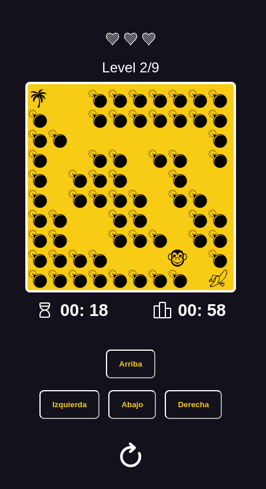

<h3>Hello Visitor!!</h3>

# Project: Workshop javascript videogames - catch to banana

## Website:

- [click here](https://roddevwork.github.io/taller-practico-javaScript-videoGames/)

<kbd>
 
</kbd>
 

---
## Description:

- This is my version of the "video game workshop in Platzi". We did with Html, Css and JavaScript.

- In the course the logics were made

- Challenges were posed at each stage to be carried out by the student

- Layout and interaction with the user by the student

- Added a lot of own functionalities

## Autor:

- RM Design

---
